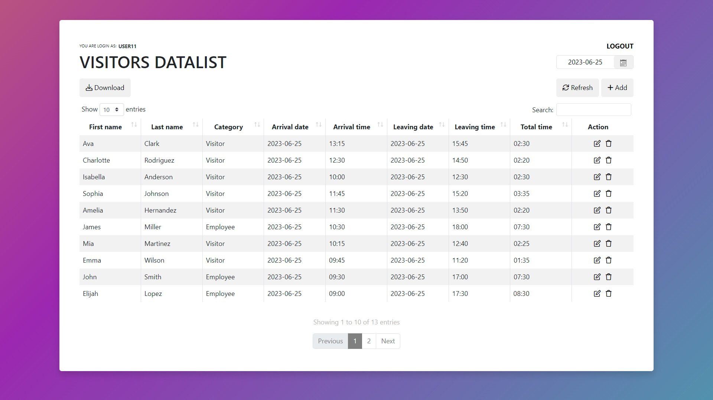
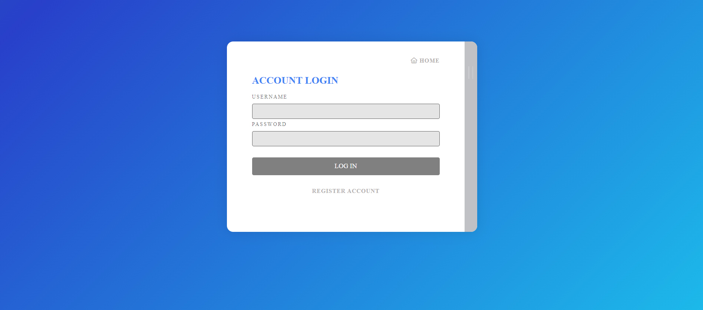
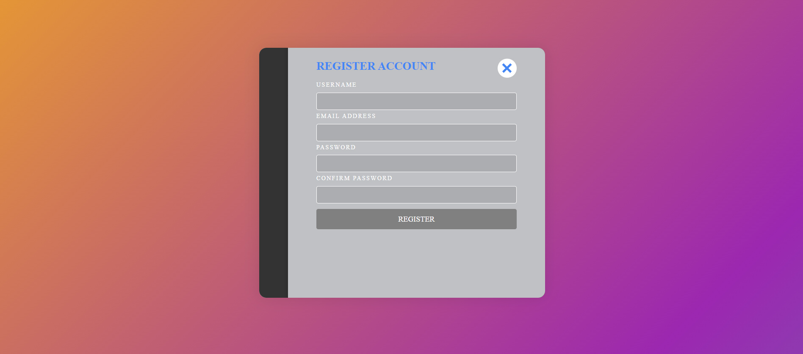

<div align="center">
  <h1>Visitors Registration</h1>
</div>

<div align="justify">

   The **Visitor Registrations** application is a visitor registration system that can be integrated and used in various organizations, offices, enterprises, medical institutions, universities, public places, etc.

   This project is a web application developed using **Node.js**, **Express.js**, **MongoDB**, **Socket.io**, etc. Implementation add-on based on the Model-View-Controller *(MVC)* architectural pattern, which allows you to easily expand the add-on logic to different components.

   The main functionality of the application includes registration and authentication of users, as well as managing visitor data. Users can register, log in and create information about visitors with their personal data, date and time of arrival and departure. The application also provides the ability to view the list of visitors by a certain date and when users change information *(create, update, delete)*, it updates the table with data in real time.

   Additionally, the project provides the functionality of exporting data in Excel format, which allows you to download a table with information about visitors for a specific date and conduct analytics.

   The advantages of this project include an intuitive interface, ease of use, additional tools for working with the table *(sorting, searching by the table, number of rows displayed per page)*, real-time data update for all users *(AJAX, Socket.io)*, high level of security *(using CSRF tokens and JWT)* and the flexibility to extend functionality using **Node.js** and **Express.js**.

   This project can be used in various organizations that require registration and management of visitors.

   <br>


</div>

<p align="center">
  
  <br>
</p>

<p align="center">
  
  <br>
</p>

<p align="center">
  
  <br>
</p>

<br>

<div align="center">

   # Settings

</div>

<div align="left">

1. Clone this repository

```
   git clone https://github.com/lazycatcoder/visitors-registration.git
```


2. Install **Node.js**
   
**Node.js** and **npm** (Node Package Manager) should be installed on your system. You can download them from the official Node.js website: *https://nodejs.org*

3. Install **MongoDB** 

Install **MongoDB Compass** from official website: *https://www.mongodb.com/*  
After installation **MongoDB Compass** create the *visitors_db* database on *localhost:27017*

4. Install Dependencies

Open a terminal or command prompt, navigate to the extracted/cloned repository folder. Run the following command to install the required dependencies listed in the **package.json** file:

```
   npm install
```

5. Start the Server 🚀

In the same terminal or command prompt, navigate to the repository folder.
Run the following command to start the server:

```
   nodemon app.js
```
The server should now be running and listening for requests on the specified port *(default is port 3000)*.

6. Access the Application

Open a web browser. In the address bar, enter *http://localhost:3000*

</div>